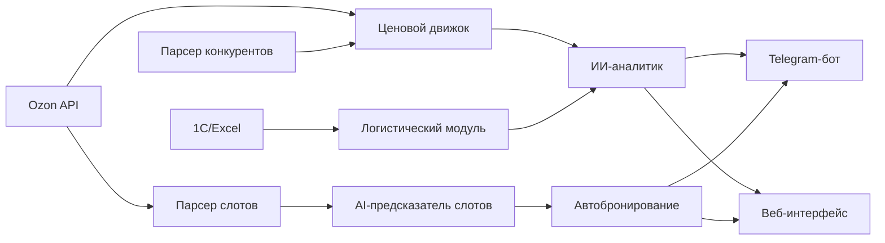
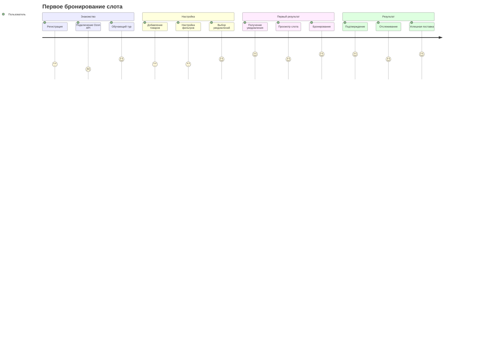

### *PRD: Ozon Slot Finder & Price Optimizer Pro*
*Версия:* 5.0
*Дата:* 27 января 2025

---

### *1. Обзор и цели*
*Название:* Ozon Slot Finder & Price Optimizer Pro
*Цель:* Комплексное решение для автоматизации логистики и динамического ценообразования на Ozon с ИИ-аналитикой.

*Ключевые проблемы:*
- Продавцы теряют до 30% прибыли из-за ручного поиска слотов поставок
- Неэффективное ценообразование без учета конкурентов
- Отсутствие защиты от недобросовестной конкуренции

*Уникальные преимущества:*
- **Автоматический мониторинг слотов поставок** с AI-предсказанием
- Тройная система мониторинга (цены + логистика + махинации)
- Интеллектуальный симулятор ценовых решений
- Автоматизированная защита от демпинга

---

### *2. Основные функции*

#### *2.1. Сервис мониторинга слотов поставок*
*Проблема:* Продавцы тратят 3-4 часа в день на поиск свободных слотов FBS/FBO
*Решение:* Автоматизированный мониторинг с мгновенными уведомлениями

*Ключевые возможности:*
- **Парсинг слотов:** Обновление каждые 5 минут через Ozon API + Selenium
- **AI-предсказания:** Оптимальное время бронирования на основе исторических данных
- **Автобронирование:** Умные фильтры по складу, времени, типу товара
- **Уведомления:** Telegram-бот, Email, Push, SMS для критических слотов

*Целевая аудитория:*
| Сегмент | Потребности | Объем |
|---------|------------|-------|
| Малые продавцы | Уведомления о слотах | 50-100 товаров/мес |
| Оптовики | Мониторинг 500+ позиций | Пакетные поставки |
| Логистические компании | API для интеграции | 1000+ заказов |

*Пример работы:*
```
🚀 Найден слот!
📦 Склад: Тверь (FBS)
📅 Дата: 29.01.2025, 14:00-16:00
📊 AI-рейтинг: 95% (оптимальный)
🎯 Товары: 12 позиций готовы к отправке
⚡ Автобронирование через 30 сек
```

#### *2.2. Жесткая ценовая привязка с гибкими правилами*
*Формула:*
python
def calculate_price(base_price, product_type):
    rules = {
        'HIT': 0.95,      # 5% ниже конкурентов
        'OUTDATED': 0.8,  # 20% ниже + фикс.скидка
        'PREMIUM': 1.1    # 10% выше
    }
    return base_price * rules[product_type]


#### *2.2. Интеллектуальный симулятор цен*
*Технологии:*
- Prophet для прогнозирования спроса
- Scikit-learn для анализа эластичности

*Пример вывода:*
plaintext
🔮 Прогноз при цене 5490 ₽ (-8%):
- Ожидаемые продажи: 42-48 ед./нед
- Маржинальность: 22-25%
- Риск: Конкурент "TechZone" может ответить скидкой


#### *2.3. Логистический оптимизатор*
*Интеграции:*
- Ozon Stock API
- 1С/Excel через CSV-импорт

*Логика работы:*
mermaid
graph TD
    A[Остатки] --> B{<10 шт?}
    B -->|Да| C[+10% к цене]
    B -->|Нет| D{Поставка через <7 дней?}
    D -->|Да| E[-5% для ускорения продаж]
    D -->|Нет| F[Стандартная цена]


#### *2.4. Детектор недобросовестной конкуренции*
*Обнаруживает:*
- Фейковые отзывы (NLP-анализ)
- Подставные магазины (анализ паттернов)
- Демпинг (>30% за час)

*Пример алерта:*
plaintext
🚨 Обнаружен подозрительный магазин "GadgetPro":
- 23 идентичных отзыва за 2 часа
- Цена на AirPods 4990 ₽ (рыночная 12990 ₽)
Рекомендуем: подать жалобу через Ozon API


---

### *3. Техническая реализация*

#### *3.1. Архитектура*


*Новые компоненты для слотов:*
- **Парсер слотов:** Мониторинг доступности FBS/FBO каждые 5 минут
- **AI-предсказатель:** Анализ паттернов освобождения слотов
- **Автобронирование:** Система умного резервирования с приоритетами


#### *3.2. Стек технологий*
| Компонент       | Технологии                  |
|-----------------|-----------------------------|
| *Бэкенд*     | Python (FastAPI, Celery)    |
| *ИИ-модели*  | Prophet, PyTorch, SKlearn   |
| *Фронтенд*   | React + TypeScript + Chakra UI |
| *Парсинг слотов* | Selenium, BeautifulSoup, Proxy rotation |
| *Уведомления* | Telegram Bot API, SendGrid, FCM |
| *База данных* | PostgreSQL, Redis (кэш)     |
| *Безопасность*| JWT, AES-256, RBAC          |
| *Мониторинг*  | Prometheus, Grafana         |

---

### *4. Этапы разработки*

#### *4.1. MVP - Slot Finder (2 месяца)*
- ✅ Базовый парсинг слотов FBS/FBO
- ✅ Telegram-бот с уведомлениями
- ✅ Веб-интерфейс для настроек
- ✅ Интеграция с Ozon API

#### *4.2. Автоматизация (1 месяц)*
- 🔄 AI-предсказания оптимальных слотов
- 🔄 Автобронирование с фильтрами
- 🔄 Расширенная аналитика
- 🔄 Мобильное приложение

#### *4.3. Price Optimizer (2 месяца)*
- 📋 Движок ценообразования
- 📋 ИИ-симулятор цен
- 📋 Детектор недобросовестной конкуренции
- 📋 Интеграция с логистикой

#### *4.4. Масштабирование (2 месяца)*
- 📋 API для интеграций
- 📋 White-label решения
- 📋 Поддержка других маркетплейсов
- 📋 Корпоративные функции

---

### *5. Конкурентные преимущества*

| Критерий               | Ozon Slot Finder Pro   | Конкуренты             |
|------------------------|------------------------|------------------------|
| *Мониторинг слотов*  | Автоматический 24/7    | Ручной поиск           |
| *AI-предсказания*    | Оптимальное время бронирования | Нет |
| *Автобронирование*   | Умные фильтры + приоритеты | Ручное бронирование |
| *Глубина анализа*    | Слоты + цены + логистика + NLP | Только мониторинг цен |
| *Прогнозирование*    | ИИ-симулятор цен       | Нет                    |
| *Защита от демпинга* | Автодетектор махинаций | Ручная проверка        |
| *Интеграции*         | Ozon API + 1C + Telegram | Ограниченные          |

---

### *6. UX/UI Дизайн и Пользовательский Опыт*

#### *6.1. Wireframes основных экранов*

##### *Главная страница (Dashboard)*
```
┌─────────────────────────────────────────────────────────────┐
│ [🏠] Ozon Slot Finder Pro    [🔔] [👤] [⚙️]              │
├─────────────────────────────────────────────────────────────┤
│                                                             │
│  📊 Сводка за сегодня                    🎯 Быстрые действия │
│  ┌─────────────┬─────────────┬─────────────┐  ┌─────────────┐ │
│  │ 🚚 Слоты    │ 💰 Цены     │ 📦 Товары   │  │ + Добавить  │ │
│  │ Найдено: 12 │ Изменено: 8 │ Активно: 45 │  │   товар     │ │
│  └─────────────┴─────────────┴─────────────┘  └─────────────┘ │
│                                                             │
│  🔥 Критические уведомления                                  │
│  ┌─────────────────────────────────────────────────────────┐ │
│  │ ⚠️  Слот на складе Москва освободился!                  │ │
│  │     Товар: iPhone 15 Pro | Время: 14:00-16:00          │ │
│  │     [Забронировать] [Отложить] [Настроить]              │ │
│  └─────────────────────────────────────────────────────────┘ │
│                                                             │
│  📈 Аналитика производительности                             │
│  ┌─────────────────────────────────────────────────────────┐ │
│  │     Прибыль ↗️ +23%    Слоты ↗️ +15%    Цены ↗️ +8%     │ │
│  │  [График за неделю]                                    │ │
│  └─────────────────────────────────────────────────────────┘ │
└─────────────────────────────────────────────────────────────┘
```

##### *Мониторинг слотов*
```
┌─────────────────────────────────────────────────────────────┐
│ 🚚 Мониторинг слотов поставок                               │
├─────────────────────────────────────────────────────────────┤
│ Фильтры: [Склад ▼] [Дата ▼] [Тип товара ▼] [🔍 Поиск]     │
│                                                             │
│ 🟢 Доступные слоты (Обновлено: 2 мин назад)                │
│ ┌─────────────────────────────────────────────────────────┐ │
│ │ 📍 Склад Москва-Север    📅 27.01.2025  ⏰ 14:00-16:00  │ │
│ │ 📦 Категория: Электроника  👥 Мест: 15/20               │ │
│ │ 🤖 AI-рекомендация: ⭐⭐⭐⭐⭐ Оптимальное время!        │ │
│ │ [🎯 Забронировать] [⭐ В избранное] [📊 Аналитика]       │ │
│ └─────────────────────────────────────────────────────────┘ │
│                                                             │
│ 🟡 Ожидаемые слоты (AI-прогноз)                            │
│ ┌─────────────────────────────────────────────────────────┐ │
│ │ 📍 Склад СПб-Юг         📅 28.01.2025  ⏰ 10:00-12:00  │ │
│ │ 🎯 Вероятность: 85%     ⏱️ Ожидается через: 4 часа     │ │
│ │ [🔔 Уведомить] [📈 История] [⚙️ Настроить]              │ │
│ └─────────────────────────────────────────────────────────┘ │
└─────────────────────────────────────────────────────────────┘
```

##### *Управление ценами*
```
┌─────────────────────────────────────────────────────────────┐
│ 💰 Динамическое ценообразование                             │
├─────────────────────────────────────────────────────────────┤
│ 📊 Обзор товаров                                           │
│ ┌─────────────────────────────────────────────────────────┐ │
│ │ 🎧 AirPods Pro 2                                        │ │
│ │ Текущая цена: 24,990₽  📈 +5% за неделю                │ │
│ │ Конкуренты: от 23,500₽ до 26,900₽                      │ │
│ │ 🤖 AI-рекомендация: Снизить до 24,200₽ (+12% продаж)   │ │
│ │ [✅ Применить] [📊 Анализ] [⚙️ Стратегия]               │ │
│ └─────────────────────────────────────────────────────────┘ │
│                                                             │
│ 🎯 Ценовые стратегии                                       │
│ ┌─────────────────────────────────────────────────────────┐ │
│ │ ⚡ Агрессивная: -5% от минимальной цены конкурентов     │ │
│ │ ⚖️ Сбалансированная: Средняя цена рынка ±2%            │ │
│ │ 💎 Премиум: +10% от максимальной цены                  │ │
│ │ 🤖 AI-оптимизация: Динамическая на основе спроса       │ │
│ └─────────────────────────────────────────────────────────┘ │
└─────────────────────────────────────────────────────────────┘
```

#### *6.2. User Journey Map*

##### *Сценарий 1: Новый пользователь - Первое бронирование слота*


##### *Эмоциональная карта пользователя*
| Этап | Эмоция | Боли | Возможности |
|------|--------|------|-------------|
| **Регистрация** | 😐 Нейтрально | Сложная настройка API | Простой onboarding |
| **Первые настройки** | 🤔 Любопытство | Много параметров | Умные предустановки |
| **Ожидание слотов** | 😰 Тревога | Неопределенность | Прогнозы AI |
| **Первое уведомление** | 😃 Радость | - | Быстрое действие |
| **Успешное бронирование** | 🎉 Восторг | - | Автоматизация |

#### *6.3. Accessibility требования (WCAG 2.1)*

##### *Уровень AA соответствия*
- **🎨 Цветовой контраст:** Минимум 4.5:1 для обычного текста, 3:1 для крупного
- **⌨️ Навигация с клавиатуры:** Все функции доступны без мыши
- **🔊 Скринридеры:** Поддержка ARIA-меток и семантической разметки
- **📱 Масштабирование:** До 200% без потери функциональности

##### *Конкретные требования*
```markdown
### Визуальные элементы
- Иконки сопровождаются текстовыми подписями
- Цвет не является единственным способом передачи информации
- Анимации можно отключить (prefers-reduced-motion)

### Интерактивные элементы
- Минимальный размер кнопок: 44x44px
- Видимый фокус для всех интерактивных элементов
- Таймауты можно продлить или отключить

### Контент
- Заголовки структурированы иерархически (h1-h6)
- Альтернативный текст для всех изображений
- Субтитры для видео-контента
```

#### *6.4. Responsive Design спецификации*

##### *Breakpoints*
```css
/* Mobile First подход */
$mobile: 320px;     /* Мобильные устройства */
$tablet: 768px;     /* Планшеты */
$desktop: 1024px;   /* Десктопы */
$wide: 1440px;      /* Широкие экраны */
```

##### *Адаптивная сетка*
| Устройство | Колонки | Отступы | Контент |
|------------|---------|---------|---------|
| **📱 Mobile** | 1 | 16px | Стек вертикально |
| **📱 Tablet** | 2-3 | 24px | Смешанная сетка |
| **💻 Desktop** | 3-4 | 32px | Горизонтальная |
| **🖥️ Wide** | 4-6 | 40px | Максимальная плотность |

##### *Компонентная адаптивность*
```markdown
### Dashboard карточки
- Mobile: 1 колонка, полная ширина
- Tablet: 2 колонки, 50% ширины
- Desktop: 3-4 колонки, фиксированная ширина

### Таблицы данных
- Mobile: Карточный вид с аккордеонами
- Tablet: Горизонтальный скролл
- Desktop: Полная таблица

### Навигация
- Mobile: Hamburger меню + bottom tabs
- Tablet: Sidebar + top navigation
- Desktop: Полная sidebar навигация
```

---

### *7. Безопасность и Compliance*

#### *7.1. Расширенная архитектура безопасности*

##### *Аутентификация и авторизация*
```markdown
### JWT Implementation
- **Access Token:** 15 минут жизни
- **Refresh Token:** 7 дней, хранится в httpOnly cookie
- **Token Rotation:** Автоматическое обновление
- **Blacklist:** Redis для отозванных токенов

### RBAC (Role-Based Access Control)
- **Admin:** Полный доступ к системе
- **Manager:** Управление командой и настройками
- **User:** Базовый функционал
- **Viewer:** Только просмотр данных

### Multi-Factor Authentication (MFA)
- **TOTP:** Google Authenticator, Authy
- **SMS:** Резервный метод
- **Email:** Уведомления о входе
```

##### *Шифрование данных*
```markdown
### Данные в покое (Data at Rest)
- **Database:** AES-256 шифрование на уровне поля
- **Файлы:** Шифрование S3 bucket с KMS
- **Логи:** Шифрование чувствительных данных

### Данные в движении (Data in Transit)
- **HTTPS:** TLS 1.3 для всех соединений
- **API:** Certificate pinning
- **WebSocket:** WSS с валидацией сертификатов
```

#### *7.2. GDPR Compliance*

##### *Принципы обработки данных*
```markdown
### Законность обработки
- ✅ Согласие пользователя на обработку
- ✅ Договорные обязательства
- ✅ Законные интересы (с балансом прав)

### Минимизация данных
- Собираем только необходимые данные
- Автоматическое удаление через 2 года неактивности
- Анонимизация аналитических данных

### Права субъектов данных
- **Право на доступ:** API для экспорта данных
- **Право на исправление:** Интерфейс редактирования
- **Право на удаление:** "Забыть меня" функция
- **Право на портируемость:** JSON/CSV экспорт
```

##### *Техническая реализация GDPR*
```typescript
// Пример API для GDPR
interface GDPRService {
  // Экспорт всех данных пользователя
  exportUserData(userId: string): Promise<UserDataExport>;

  // Удаление всех данных пользователя
  deleteUserData(userId: string): Promise<void>;

  // Анонимизация данных
  anonymizeUserData(userId: string): Promise<void>;

  // Логирование согласий
  logConsent(userId: string, consentType: string): Promise<void>;
}
```

#### *7.3. Rate Limiting и API Protection*

##### *Многоуровневая защита*
```markdown
### Глобальные лимиты
- **IP-based:** 1000 запросов/час
- **User-based:** 500 запросов/час
- **API Key:** 10000 запросов/день

### Endpoint-специфичные лимиты
- **Login:** 5 попыток/15 минут
- **Password Reset:** 3 попытки/час
- **File Upload:** 10 файлов/час
- **Price Updates:** 100 изменений/день

### Защита от DDoS
- **Cloudflare:** L3/L4 защита
- **Rate Limiting:** Redis-based sliding window
- **Circuit Breaker:** Автоматическое отключение при перегрузке
```

##### *Реализация Rate Limiting*
```typescript
// Express middleware для rate limiting
import rateLimit from 'express-rate-limit';
import RedisStore from 'rate-limit-redis';

const apiLimiter = rateLimit({
  store: new RedisStore({
    client: redisClient,
  }),
  windowMs: 60 * 60 * 1000, // 1 час
  max: 1000, // лимит запросов
  message: {
    error: 'Превышен лимит запросов',
    retryAfter: '1 час'
  },
  standardHeaders: true,
  legacyHeaders: false,
});
```

#### *7.4. Audit Logging*

##### *Критические события для логирования*
```markdown
### Аутентификация
- Успешный/неуспешный вход
- Смена пароля
- Активация MFA
- Подозрительная активность

### Бизнес-операции
- Изменение цен товаров
- Бронирование слотов
- Изменение настроек автоматизации
- Экспорт данных

### Административные действия
- Создание/удаление пользователей
- Изменение ролей и прав
- Изменение системных настроек
- Доступ к логам
```

##### *Структура audit лога*
```json
{
  "timestamp": "2025-01-27T14:30:00Z",
  "eventType": "PRICE_CHANGE",
  "userId": "user_12345",
  "sessionId": "sess_67890",
  "ipAddress": "192.168.1.100",
  "userAgent": "Mozilla/5.0...",
  "resource": {
    "type": "product",
    "id": "prod_54321",
    "name": "iPhone 15 Pro"
  },
  "changes": {
    "oldPrice": 89990,
    "newPrice": 87990,
    "reason": "competitor_analysis"
  },
  "result": "success",
  "riskLevel": "medium"
}
```

#### *7.5. Backup & Recovery стратегия*

##### *Backup политика*
```markdown
### Частота резервного копирования
- **Критические данные:** Каждые 4 часа
- **Пользовательские данные:** Ежедневно
- **Конфигурации:** При каждом изменении
- **Логи:** Еженедельно

### Типы backup
- **Full Backup:** Еженедельно (воскресенье)
- **Incremental:** Ежедневно
- **Transaction Log:** Каждые 15 минут
- **Configuration:** При изменениях

### Хранение backup
- **Primary:** AWS S3 (3 копии)
- **Secondary:** Azure Blob Storage
- **Offline:** Ежемесячные архивы на Glacier
```

##### *Disaster Recovery Plan*
```markdown
### RTO/RPO цели
- **RTO (Recovery Time Objective):** 4 часа
- **RPO (Recovery Point Objective):** 15 минут
- **Критичность:** Tier 1 (бизнес-критичная)

### Сценарии восстановления
1. **Частичный сбой:** Автоматическое переключение на replica
2. **Полный сбой региона:** Переключение на DR-сайт
3. **Повреждение данных:** Восстановление из backup
4. **Кибератака:** Изоляция и восстановление из чистых backup

### Тестирование DR
- **Ежемесячно:** Тест восстановления из backup
- **Ежеквартально:** Полный DR drill
- **Ежегодно:** Chaos engineering тесты
```

---

### *8. Аналитика и мониторинг*

#### *8.1. Пользовательская аналитика*

##### *Ключевые метрики поведения*
```markdown
### Engagement метрики
- **DAU/MAU:** Ежедневные/месячные активные пользователи
- **Session Duration:** Среднее время сессии
- **Page Views:** Просмотры страниц за сессию
- **Bounce Rate:** Процент отказов

### Feature Adoption
- **Slot Monitoring:** % пользователей, настроивших мониторинг
- **Auto-booking:** % использующих автобронирование
- **Price Optimization:** % активных ценовых стратегий
- **AI Recommendations:** % принятых рекомендаций

### Conversion Funnel
1. **Регистрация → Активация:** 85%
2. **Активация → Первое использование:** 70%
3. **Первое использование → Регулярное:** 60%
4. **Бесплатная → Платная версия:** 15%
```

##### *Инструменты аналитики*
```markdown
### Google Analytics 4
- **Enhanced Ecommerce:** Отслеживание конверсий
- **Custom Events:** Бизнес-специфичные события
- **Audience Segments:** Сегментация пользователей
- **Attribution Modeling:** Анализ каналов привлечения

### Mixpanel
- **Event Tracking:** Детальная аналитика действий
- **Cohort Analysis:** Анализ удержания пользователей
- **Funnel Analysis:** Оптимизация конверсий
- **A/B Testing:** Тестирование гипотез

### Hotjar
- **Heatmaps:** Карты кликов и скроллинга
- **Session Recordings:** Записи пользовательских сессий
- **Feedback Polls:** Опросы пользователей
- **User Interviews:** Качественные исследования
```

#### *8.2. Бизнес-метрики и KPI*

##### *Revenue метрики*
```markdown
### Подписочная модель
- **MRR (Monthly Recurring Revenue):** Ежемесячная выручка
- **ARR (Annual Recurring Revenue):** Годовая выручка
- **ARPU (Average Revenue Per User):** Средняя выручка на пользователя
- **LTV (Lifetime Value):** Пожизненная ценность клиента

### Рост и удержание
- **Growth Rate:** Темп роста выручки (месяц к месяцу)
- **Churn Rate:** Процент оттока пользователей
- **Net Revenue Retention:** Чистое удержание выручки
- **Expansion Revenue:** Выручка от апгрейдов
```

##### *Операционные метрики*
```markdown
### Эффективность продукта
- **Slot Success Rate:** % успешных бронирований
- **Price Optimization ROI:** ROI от оптимизации цен
- **AI Accuracy:** Точность AI-рекомендаций
- **User Satisfaction (NPS):** Net Promoter Score

### Стоимость привлечения
- **CAC (Customer Acquisition Cost):** Стоимость привлечения клиента
- **Payback Period:** Период окупаемости клиента
- **Marketing ROI:** ROI маркетинговых кампаний
- **Organic vs Paid:** Соотношение органического и платного трафика
```

#### *8.3. Технические метрики*

##### *Performance мониторинг*
```markdown
### Application Performance
- **Response Time:** P95 < 500ms, P99 < 1s
- **Throughput:** Requests per second
- **Error Rate:** < 0.1% для критических операций
- **Apdex Score:** > 0.9 для пользовательского опыта

### Infrastructure метрики
- **CPU Utilization:** < 70% в среднем
- **Memory Usage:** < 80% от доступной
- **Disk I/O:** Мониторинг IOPS и latency
- **Network:** Bandwidth utilization и packet loss

### Database Performance
- **Query Performance:** Slow queries > 1s
- **Connection Pool:** Utilization и wait times
- **Replication Lag:** < 1 секунда
- **Storage:** Рост размера БД и fragmentation
```

##### *Мониторинг стек*
```markdown
### Prometheus + Grafana
- **Custom Metrics:** Бизнес-специфичные метрики
- **Alerting:** Автоматические уведомления
- **Dashboards:** Визуализация в реальном времени
- **Historical Data:** Долгосрочное хранение метрик

### ELK Stack (Elasticsearch, Logstash, Kibana)
- **Log Aggregation:** Централизованное логирование
- **Search & Analysis:** Поиск по логам
- **Visualization:** Дашборды для логов
- **Alerting:** Уведомления по паттернам в логах

### APM (Application Performance Monitoring)
- **New Relic/DataDog:** Детальный мониторинг приложения
- **Distributed Tracing:** Отслеживание запросов между сервисами
- **Error Tracking:** Автоматическое обнаружение ошибок
- **Real User Monitoring:** Мониторинг реального пользовательского опыта
```

#### *8.4. A/B тестирование и оптимизация*

##### *Платформа для экспериментов*
```markdown
### Инструменты
- **Optimizely:** Enterprise A/B testing
- **Google Optimize:** Интеграция с Analytics
- **LaunchDarkly:** Feature flags и gradual rollouts
- **Custom Solution:** Собственная система экспериментов

### Типы экспериментов
- **UI/UX тесты:** Дизайн, layout, цвета
- **Feature тесты:** Новый функционал
- **Pricing тесты:** Модели ценообразования
- **Onboarding тесты:** Процесс регистрации и активации
```

##### *Методология экспериментов*
```markdown
### Процесс A/B тестирования
1. **Гипотеза:** Четкое описание ожидаемого эффекта
2. **Метрики:** Определение success metrics
3. **Sample Size:** Расчет необходимого размера выборки
4. **Duration:** Определение длительности теста
5. **Analysis:** Статистический анализ результатов
6. **Decision:** Принятие решения на основе данных

### Статистическая значимость
- **Confidence Level:** 95% для большинства тестов
- **Statistical Power:** 80% для обнаружения эффекта
- **Multiple Testing:** Коррекция Бонферрони
- **Sequential Testing:** Возможность раннего останова
```

---

### *9. Экономический эффект*

*Для клиентов (слоты):*
- Экономия времени: 4-6 часов в день
- Увеличение прибыли: 20-30% за счет своевременных поставок
- Снижение стресса: 95% автоматизация процесса
- Улучшение позиций: приоритетное размещение товаров

*Для клиентов (цены):*
- Увеличение маржинальности на 15-40%
- Сокращение времени на ценообразование на 70%
- Снижение потерь от демпинга на 90%

*Монетизация:*
| Тариф | Цена | Возможности |
|-------|------|-------------|
| **Freemium** | Бесплатно | До 10 товаров, базовые уведомления |
| **Pro** | 2990 ₽/мес | До 100 товаров, автобронирование |
| **Business** | 9990 ₽/мес | Безлимит, API, приоритет |
| **Enterprise** | От 29990 ₽/мес | White-label, кастомизация |

*Прогноз выручки (год 1):*
- Пользователи: 1000 (месяц 12)
- ARPU: 4500 ₽/месяц
- MRR: 4,500,000 ₽
- ARR: 54,000,000 ₽

---

### *7. Метрики успеха*

*Продуктовые метрики:*
- Время обнаружения слота: < 5 минут
- Точность уведомлений: > 95%
- Успешность автобронирования: > 90%
- Время отклика системы: < 2 секунд

*Бизнес-метрики:*
- Увеличение прибыли пользователей: 20-30%
- Экономия времени: 4-6 часов в день
- Retention rate: > 80% через 3 месяца
- NPS: > 50

*Технические метрики:*
- Uptime: 99.9%
- Время отклика API: < 500ms
- Пропускная способность: 1000 запросов/сек
- Точность парсинга: > 99%

---

### *8. Риски и митигация*

| Риск | Вероятность | Влияние | Митигация |
|------|-------------|---------|-----------|
| Изменение API Ozon | Высокая | Критическое | Резервный парсинг, мониторинг изменений |
| Блокировка IP | Средняя | Высокое | Ротация прокси, распределенная архитектура |
| Конкуренты | Высокая | Среднее | Уникальные AI-функции, быстрая разработка |

---

### *Приложения*

1. *Схема API-интеграций*
2. *Макеты интерфейсов:*
   - Дашборд мониторинга слотов
   - Telegram-бот для уведомлений
   - Дашборд аналитики цен
   - Мобильное подтверждение изменений
3. *Примеры детекции махинаций*
4. *AI-алгоритмы предсказания слотов*

---

*Комментарий для разработки:*
**Приоритет 1 - Slot Finder:**
1. Настройка парсинга Ozon API для слотов
2. Создание Telegram-бота с уведомлениями
3. Реализация автобронирования

**Приоритет 2 - Price Optimizer:**
1. Исторические данные за 6+ месяцев
2. Интеграция с Ozon Sales API
3. Настройка celery-beat для регулярных прогнозов

**Текущий статус:** MVP Slot Finder в разработке ✅

