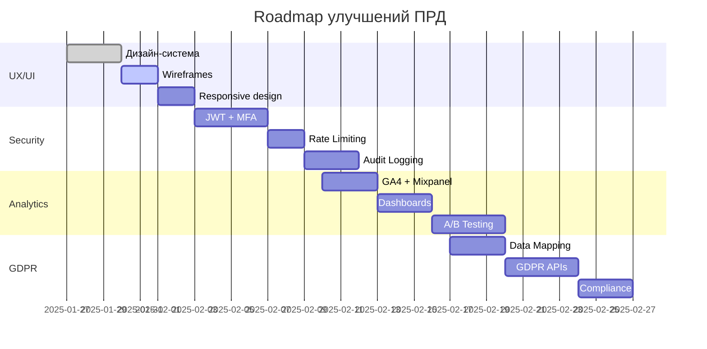

# 🚀 План реализации улучшений ПРД

**Версия:** 1.0  
**Дата:** 27 января 2025  
**Проект:** Ozon Slot Finder & Price Optimizer Pro

---

## 📋 Обзор улучшений

### ✅ Что было добавлено в ПРД:

1. **🎨 UX/UI Дизайн секция**
   - Wireframes основных экранов
   - User Journey Map с эмоциональной картой
   - WCAG 2.1 Accessibility требования
   - Responsive Design спецификации

2. **🔒 Расширенная безопасность**
   - Детальная архитектура безопасности
   - GDPR Compliance план
   - Rate Limiting стратегия
   - Audit Logging система
   - Backup & Recovery план

3. **📊 Аналитика и мониторинг**
   - Пользовательская аналитика
   - Бизнес-метрики и KPI
   - Технические метрики
   - A/B тестирование платформа

---

## 🎯 Приоритизация задач

### 🔥 **Фаза 1: Критические улучшения (2-3 недели)**

#### **Неделя 1: UX/UI Foundation**
- [ ] **Создать дизайн-систему** (3 дня)
  - Цветовая палитра для светлой/темной темы
  - Типографика и компоненты
  - Accessibility guidelines
  
- [ ] **Wireframes ключевых экранов** (2 дня)
  - Dashboard (desktop + mobile)
  - Slot monitoring
  - Price management
  
- [ ] **Responsive breakpoints** (2 дня)
  - Mobile-first CSS framework
  - Адаптивные компоненты

#### **Неделя 2-3: Безопасность**
- [ ] **JWT + MFA реализация** (4 дня)
  - Refresh token rotation
  - TOTP integration
  - Session management
  
- [ ] **Rate Limiting** (2 дня)
  - Redis-based implementation
  - Multi-layer protection
  - API endpoint limits
  
- [ ] **Audit Logging** (3 дня)
  - Event schema design
  - Elasticsearch integration
  - Real-time monitoring

### ⚡ **Фаза 2: Аналитика и мониторинг (3-4 недели)**

#### **Неделя 1-2: Базовая аналитика**
- [ ] **Google Analytics 4 setup** (2 дня)
  - Enhanced Ecommerce
  - Custom events
  - Conversion tracking
  
- [ ] **Mixpanel integration** (3 дня)
  - Event tracking
  - Funnel analysis
  - Cohort analysis
  
- [ ] **Business metrics dashboard** (3 дня)
  - Revenue tracking
  - User metrics
  - KPI visualization

#### **Неделя 3-4: Продвинутая аналитика**
- [ ] **A/B testing platform** (4 дня)
  - Feature flags
  - Statistical analysis
  - Automated decisions
  
- [ ] **Real-time monitoring** (3 дня)
  - Prometheus + Grafana
  - Alert system
  - Performance metrics
  
- [ ] **Custom analytics queries** (3 дня)
  - SQL templates
  - Automated reports
  - Data visualization

### 🔧 **Фаза 3: GDPR и Compliance (2-3 недели)**

#### **Неделя 1-2: GDPR Implementation**
- [ ] **Data mapping и classification** (3 дня)
  - Personal data inventory
  - Data flow documentation
  - Retention policies
  
- [ ] **GDPR API endpoints** (4 дня)
  - Data export
  - Data deletion
  - Consent management
  
- [ ] **Privacy policy и consent** (3 дня)
  - Legal documentation
  - Consent UI/UX
  - Cookie management

#### **Неделя 3: Backup & Recovery**
- [ ] **Backup strategy implementation** (3 дня)
  - Automated backups
  - Cross-region replication
  - Recovery testing
  
- [ ] **Disaster recovery plan** (2 дня)
  - DR procedures
  - RTO/RPO testing
  - Documentation

---

## 👥 Команда и роли

### **🎨 UX/UI Team**
- **UI/UX Designer** - Wireframes, дизайн-система
- **Frontend Developer** - Responsive implementation
- **Accessibility Specialist** - WCAG compliance

### **🔒 Security Team**
- **Security Engineer** - Authentication, encryption
- **DevOps Engineer** - Infrastructure security
- **Compliance Specialist** - GDPR implementation

### **📊 Analytics Team**
- **Data Analyst** - Metrics definition, dashboards
- **Backend Developer** - Analytics APIs
- **Data Engineer** - ETL pipelines, data warehouse

---

## 🛠️ Технический стек

### **Frontend улучшения**
```typescript
// Новые зависимости
{
  "@chakra-ui/react": "^2.8.2",
  "framer-motion": "^10.16.16",
  "react-hook-form": "^7.48.2",
  "react-query": "^3.39.3",
  "mixpanel-browser": "^2.47.0"
}
```

### **Backend улучшения**
```typescript
// Новые зависимости
{
  "express-rate-limit": "^7.1.5",
  "rate-limit-redis": "^4.2.0",
  "jsonwebtoken": "^9.0.2",
  "speakeasy": "^2.0.0",
  "winston": "^3.11.0",
  "elasticsearch": "^16.7.3"
}
```

### **Infrastructure**
```yaml
# Docker services
services:
  redis:
    image: redis:7-alpine
    
  elasticsearch:
    image: elasticsearch:8.11.0
    
  prometheus:
    image: prom/prometheus:latest
    
  grafana:
    image: grafana/grafana:latest
```

---

## 📊 Метрики успеха

### **UX/UI Метрики**
- **Accessibility Score:** > 95% (WAVE, axe)
- **Performance Score:** > 90% (Lighthouse)
- **Mobile Usability:** > 95% (Google PageSpeed)
- **User Satisfaction:** > 4.5/5 (User testing)

### **Security Метрики**
- **Security Score:** A+ (SSL Labs)
- **Vulnerability Count:** 0 Critical, < 5 Medium
- **GDPR Compliance:** 100% (Audit)
- **Incident Response Time:** < 15 minutes

### **Analytics Метрики**
- **Data Accuracy:** > 99%
- **Dashboard Load Time:** < 2 seconds
- **Real-time Latency:** < 5 seconds
- **A/B Test Velocity:** > 10 tests/month

---

## 🎯 Roadmap и вехи

### **Q1 2025 (Январь - Март)**
- ✅ **Январь:** UX/UI Foundation + Security basics
- 🔄 **Февраль:** Analytics platform + GDPR compliance
- 📋 **Март:** Advanced monitoring + Performance optimization

### **Q2 2025 (Апрель - Июнь)**
- 📋 **Апрель:** Mobile app improvements
- 📋 **Май:** AI/ML analytics features
- 📋 **Июнь:** International expansion prep

### **Ключевые вехи**


---

## 💰 Бюджет и ресурсы

### **Человеческие ресурсы**
| Роль | Недель | Ставка/неделя | Стоимость |
|------|--------|---------------|-----------|
| UI/UX Designer | 4 | $2,000 | $8,000 |
| Frontend Developer | 6 | $2,500 | $15,000 |
| Security Engineer | 5 | $3,000 | $15,000 |
| Data Analyst | 4 | $2,200 | $8,800 |
| DevOps Engineer | 3 | $2,800 | $8,400 |
| **Итого** | | | **$55,200** |

### **Инфраструктура**
| Сервис | Месяцев | Стоимость/месяц | Итого |
|--------|---------|-----------------|-------|
| Analytics tools | 12 | $500 | $6,000 |
| Security services | 12 | $300 | $3,600 |
| Monitoring stack | 12 | $200 | $2,400 |
| **Итого** | | | **$12,000** |

### **Общий бюджет: $67,200**

---

## 🚨 Риски и митигация

### **Высокие риски**
1. **Сложность GDPR compliance**
   - *Митигация:* Привлечение юридического консультанта
   - *Бюджет:* +$5,000

2. **Performance impact от security**
   - *Митигация:* Поэтапное внедрение с тестированием
   - *Время:* +1 неделя

3. **User adoption новых features**
   - *Митигация:* A/B тестирование и постепенный rollout
   - *Метрики:* Feature adoption > 70%

### **Средние риски**
1. **Интеграция с существующим кодом**
2. **Обучение команды новым технологиям**
3. **Совместимость с мобильными устройствами**

---

## ✅ Чек-лист готовности

### **Перед началом разработки**
- [ ] Команда собрана и обучена
- [ ] Техническое задание утверждено
- [ ] Инфраструктура подготовлена
- [ ] Бюджет выделен
- [ ] Риски проанализированы

### **Критерии готовности к релизу**
- [ ] Все тесты пройдены (Unit, Integration, E2E)
- [ ] Security audit завершен
- [ ] Performance тестирование пройдено
- [ ] Accessibility compliance подтвержден
- [ ] GDPR compliance проверен
- [ ] Документация обновлена
- [ ] Команда поддержки обучена

---

## 🎉 Ожидаемые результаты

### **Краткосрочные (3 месяца)**
- 📈 **User Experience:** +25% satisfaction score
- 🔒 **Security:** 100% compliance, 0 critical vulnerabilities
- 📊 **Analytics:** Real-time insights, 10+ active dashboards

### **Долгосрочные (6-12 месяцев)**
- 💰 **Business Impact:** +15% revenue growth
- 👥 **User Growth:** +30% user retention
- 🚀 **Market Position:** Industry-leading security and UX

**ГОТОВЫ К РЕАЛИЗАЦИИ! 🚀✨**
