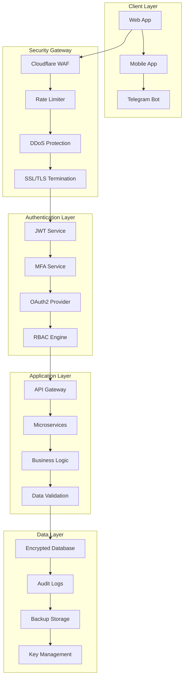
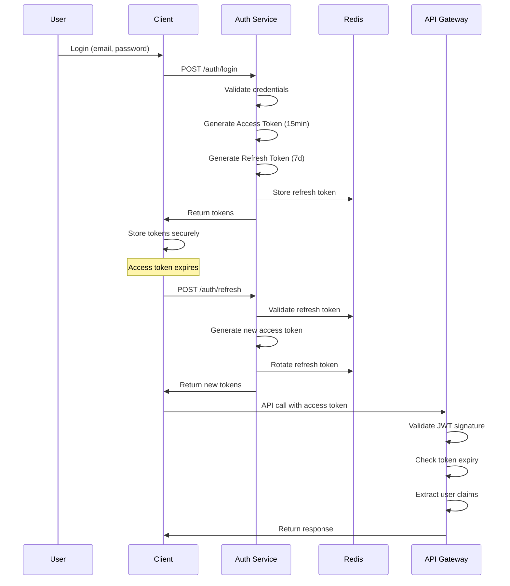
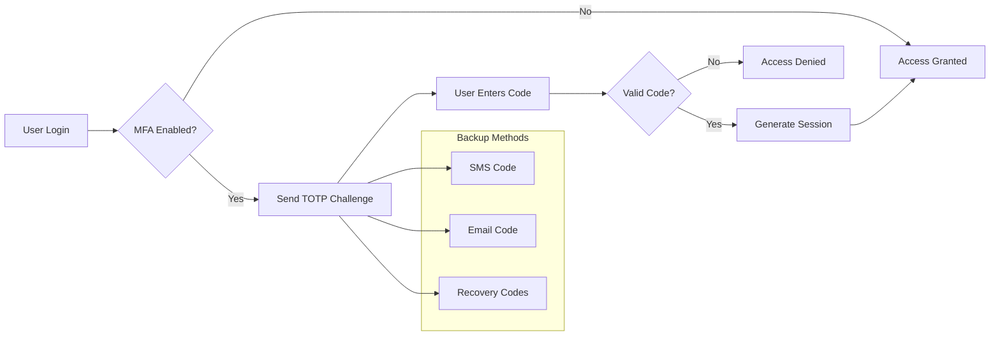
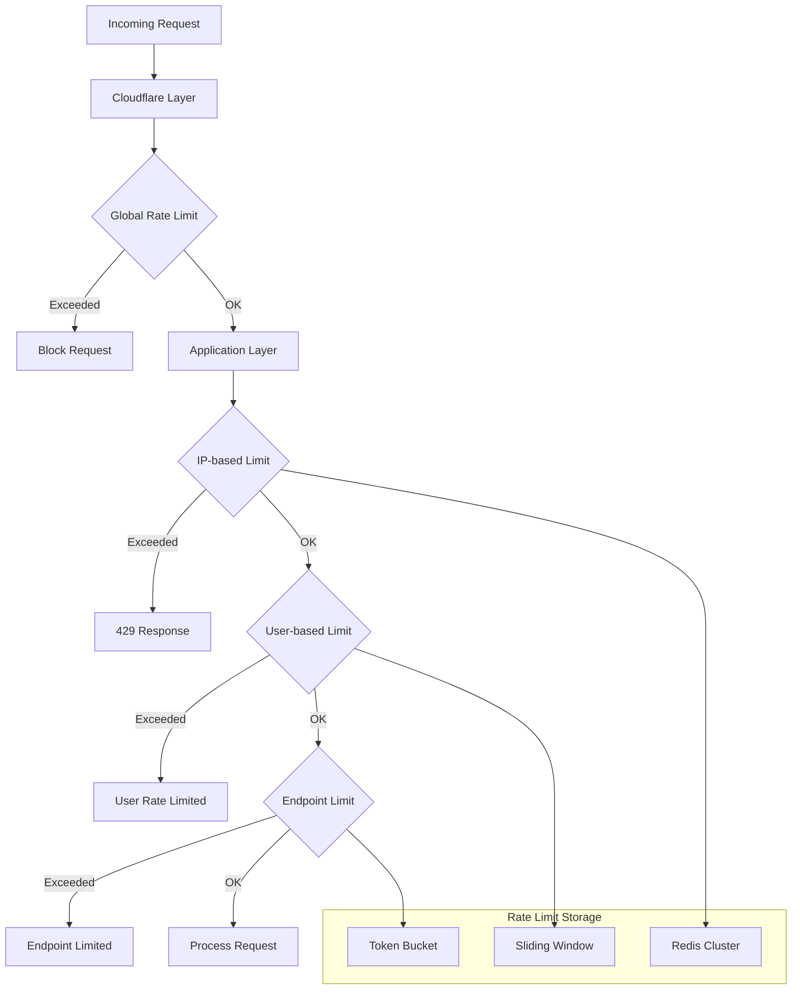
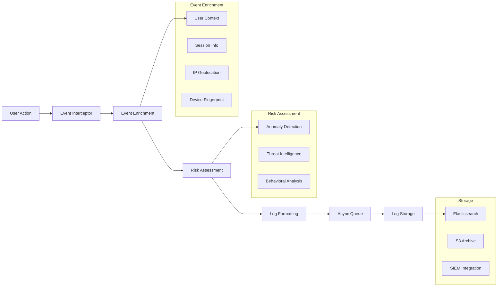
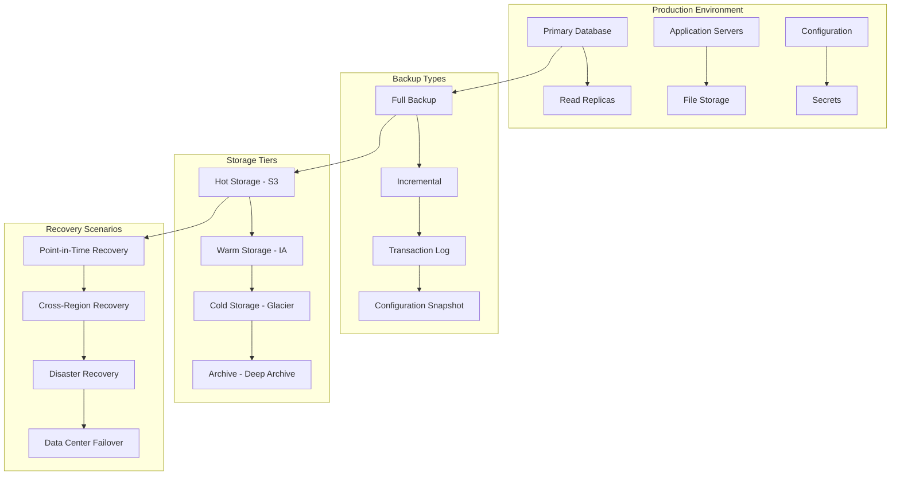
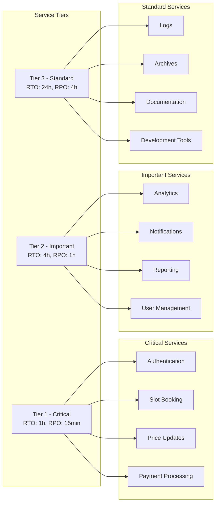
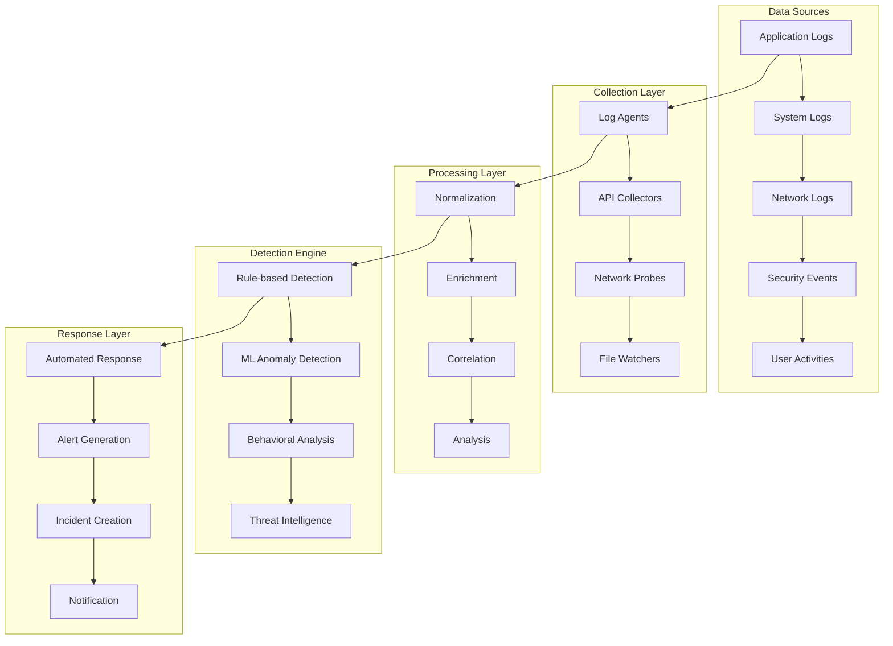
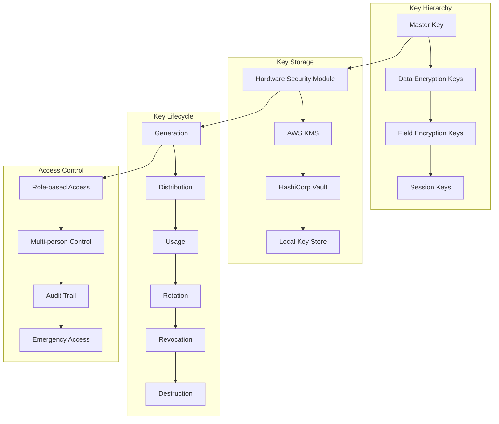
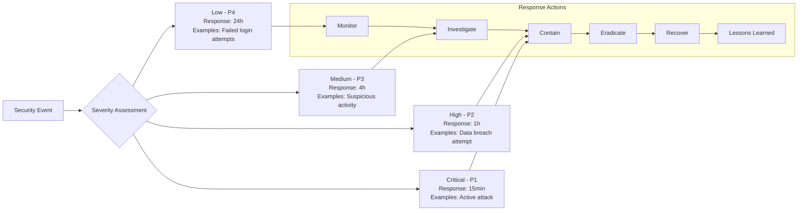

# 🔒 Архитектура безопасности

**Версия:** 1.0  
**Дата:** 27 января 2025  
**Проект:** Ozon Slot Finder & Price Optimizer Pro

---

## 🏗️ Общая архитектура безопасности



---

## 🔐 Система аутентификации

### JWT Token Flow


### Multi-Factor Authentication Flow


---

## 🛡️ Rate Limiting Architecture

### Multi-Layer Rate Limiting


### Rate Limiting Rules
```typescript
interface RateLimitRule {
  endpoint: string;
  method: string;
  limits: {
    perSecond: number;
    perMinute: number;
    perHour: number;
    perDay: number;
  };
  scope: 'ip' | 'user' | 'api_key';
  action: 'block' | 'throttle' | 'captcha';
}

const rateLimitRules: RateLimitRule[] = [
  {
    endpoint: '/auth/login',
    method: 'POST',
    limits: { perSecond: 1, perMinute: 5, perHour: 20, perDay: 100 },
    scope: 'ip',
    action: 'block'
  },
  {
    endpoint: '/api/slots/book',
    method: 'POST',
    limits: { perSecond: 2, perMinute: 10, perHour: 50, perDay: 200 },
    scope: 'user',
    action: 'throttle'
  },
  {
    endpoint: '/api/prices/update',
    method: 'PUT',
    limits: { perSecond: 5, perMinute: 30, perHour: 100, perDay: 500 },
    scope: 'user',
    action: 'throttle'
  }
];
```

---

## 📊 Audit Logging System

### Audit Event Flow


### Audit Event Schema
```typescript
interface AuditEvent {
  // Базовая информация
  id: string;
  timestamp: string;
  version: string;
  
  // Событие
  eventType: 'AUTH' | 'BUSINESS' | 'ADMIN' | 'SECURITY';
  action: string;
  result: 'SUCCESS' | 'FAILURE' | 'PARTIAL';
  
  // Пользователь
  actor: {
    userId?: string;
    sessionId: string;
    ipAddress: string;
    userAgent: string;
    location?: {
      country: string;
      city: string;
      coordinates?: [number, number];
    };
  };
  
  // Ресурс
  resource?: {
    type: string;
    id: string;
    name?: string;
    attributes?: Record<string, any>;
  };
  
  // Изменения
  changes?: {
    before?: Record<string, any>;
    after?: Record<string, any>;
    fields: string[];
  };
  
  // Безопасность
  security: {
    riskLevel: 'LOW' | 'MEDIUM' | 'HIGH' | 'CRITICAL';
    threats: string[];
    anomalies: string[];
  };
  
  // Метаданные
  metadata: {
    requestId: string;
    correlationId: string;
    source: string;
    tags: string[];
  };
}
```

---

## 🔄 Backup & Recovery Architecture

### Backup Strategy


### Recovery Time Objectives (RTO/RPO)


---

## 🔍 Security Monitoring

### SIEM Integration


### Security Metrics Dashboard
```typescript
interface SecurityMetrics {
  // Аутентификация
  authentication: {
    successfulLogins: number;
    failedLogins: number;
    mfaUsage: number;
    suspiciousLogins: number;
  };
  
  // API Security
  apiSecurity: {
    totalRequests: number;
    blockedRequests: number;
    rateLimitedRequests: number;
    maliciousRequests: number;
  };
  
  // Угрозы
  threats: {
    detectedThreats: number;
    blockedAttacks: number;
    falsePositives: number;
    criticalAlerts: number;
  };
  
  // Соответствие требованиям
  compliance: {
    gdprRequests: number;
    dataRetentionViolations: number;
    accessReviews: number;
    policyViolations: number;
  };
  
  // Производительность безопасности
  performance: {
    authenticationLatency: number;
    encryptionOverhead: number;
    scanningTime: number;
    responseTime: number;
  };
}
```

---

## 🔐 Encryption Standards

### Data Encryption Matrix
| Data Type | At Rest | In Transit | In Use |
|-----------|---------|------------|--------|
| **User Credentials** | AES-256-GCM | TLS 1.3 | Hashed (bcrypt) |
| **Personal Data** | AES-256-GCM | TLS 1.3 | Field-level encryption |
| **Financial Data** | AES-256-GCM | TLS 1.3 | Tokenization |
| **API Keys** | AES-256-GCM | TLS 1.3 | Vault storage |
| **Session Data** | AES-256-GCM | TLS 1.3 | JWT encryption |
| **Logs** | AES-256-GCM | TLS 1.3 | Selective encryption |
| **Backups** | AES-256-GCM | TLS 1.3 | Full encryption |
| **Configuration** | AES-256-GCM | TLS 1.3 | Secret management |

### Key Management


---

## 🚨 Incident Response Plan

### Incident Classification


### Automated Response Playbooks
```typescript
interface SecurityPlaybook {
  id: string;
  name: string;
  triggers: string[];
  severity: 'LOW' | 'MEDIUM' | 'HIGH' | 'CRITICAL';
  
  actions: {
    immediate: Action[];
    investigation: Action[];
    containment: Action[];
    recovery: Action[];
  };
  
  notifications: {
    teams: string[];
    escalation: EscalationRule[];
    external: ExternalNotification[];
  };
  
  sla: {
    responseTime: number;
    resolutionTime: number;
    updateFrequency: number;
  };
}

interface Action {
  type: 'BLOCK_IP' | 'DISABLE_USER' | 'ISOLATE_SYSTEM' | 'COLLECT_EVIDENCE';
  parameters: Record<string, any>;
  timeout: number;
  rollback?: Action;
}
```
